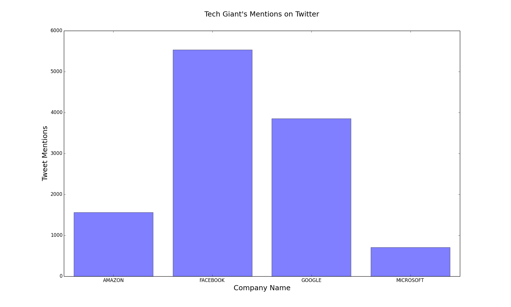
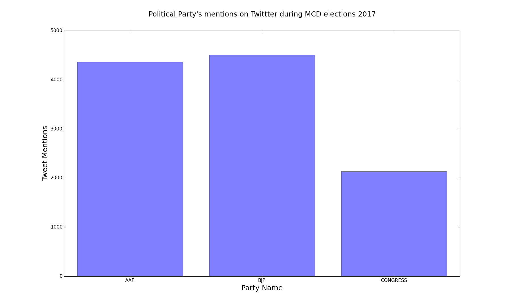

# TrendingTopicsOnTwitter
A Big Data Hadoop Project which helps in analyzing the trending topics on twitter based on there mentions on the tweets by various user across the globe.

The project uses technologies like :
1. Python
2. JAVA
3. Hadoop
4. Twitter API

<b>Python</b>: Python is used for 
- getting streamed data using the Twitter API.
- Plotting graph for analysis of the processed data

<b>JAVA</b>: JAVA is used for creating MAPREDUCE project.

<b>Hadoop</b>: Hadoop is used for processing of the huge amount of streamed data as it helps in faster processing.

# Steps to follow

# 1. Create Twitter APP

Create a Twitter App for getting access to the twitter data.  
<a href = "https://dev.twitter.com/streaming/overview">Click here</a> and follow the instructions provided.

# 2. Access Twitter Data

- Use the python script provided in the PythonScripts/GetTweet.py and scpecify the keyword for your search as arguments from the terminal.
- Save the output which is on json format to a file.

Command to run and save the data:  
<kbd> python GetTweet.py Google Facebook Amazon Microsoft > TwitterData.txt </kbd>

Note: Make sure you changed the current working directory to the location where your program resides before running the above program.

# 3. Running Map Reduce Job

Place the data obtained from Step 2 on HDFS and run the Map Reduce project TTT to get the jar.

# 4. Plot and Analyze the results

- Get the output data after successful completion of step 3 from HDFS to your local disk.
- Run the Python script PythonScripts/plotGraph.py 

# Sample Output

   

